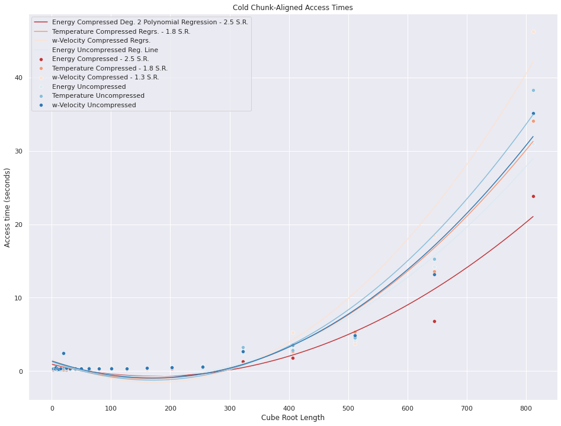
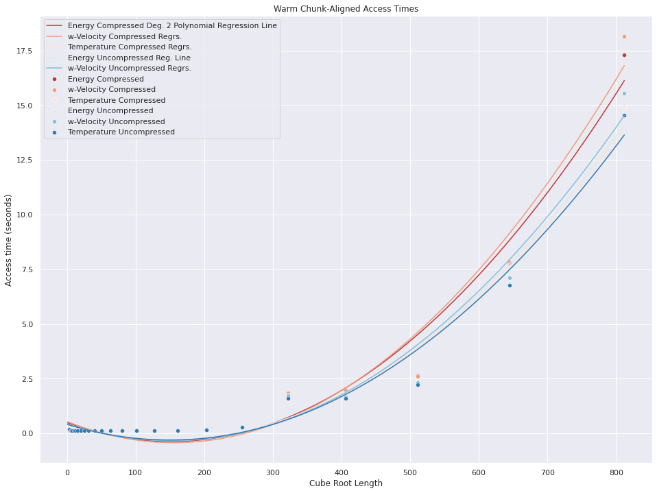
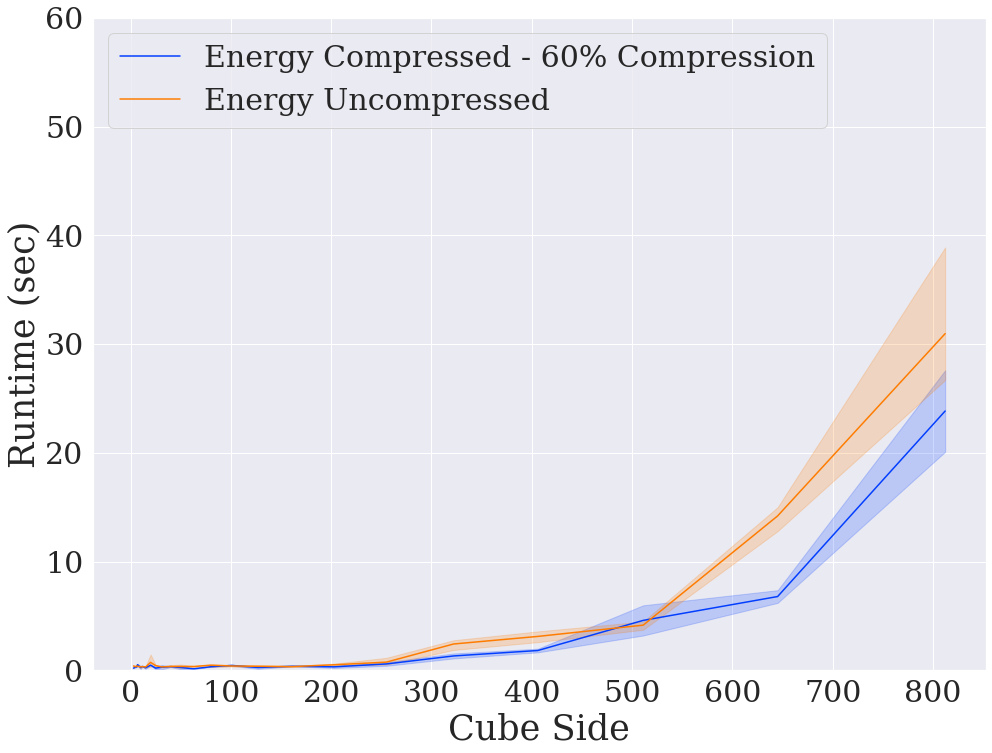
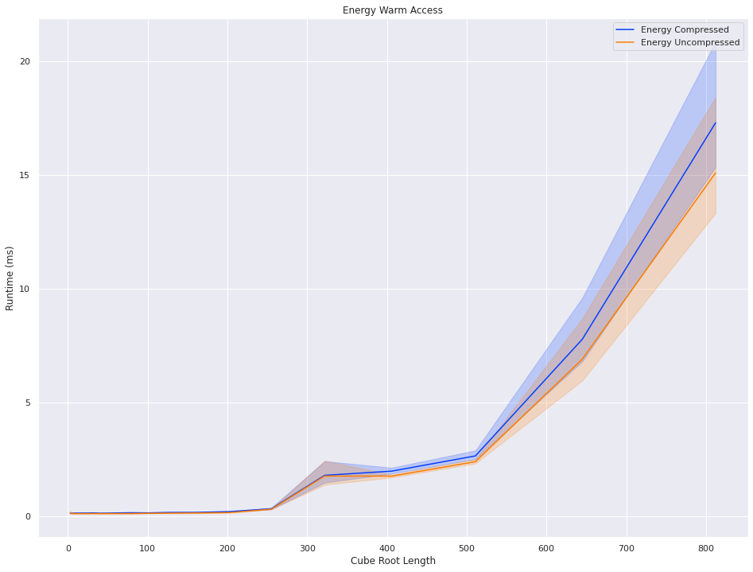

## Experiments on the Read Speed of the [Zarr](https://zarr.readthedocs.io/en/stable/) package under different circumstances

These include:

- How much Compression affects read speed
- Effects of using Sharding on performance
- Effects of increasing `chunk_size` 
- Whether joining data variables together improves read speed

These are done both in repeated (warm) or first-time (cold) access

### Accompanying Articles

- [To Compress or Not to Compress — A Zarr Question](https://medium.com/@lubonjaariel/to-compress-or-not-to-compress-a-zarr-question-812160b3777d)
- [Efficiently Querying Large Scientific Data Using Zarr’s partial decompress](https://medium.com/@lubonjaariel/efficiently-querying-large-scientific-data-using-zarrs-partial-decompress-e4db9c96c510)

**_Please open an issue if you'd like to see other experiments!_**

## Interesting Results

1. Effects of Increasing `chunk_size` on Cold Access Speed

2. Same but Warm (Repeated) Access

3. Cold Access Speed w/ 60% Compression Ratio

4. Same but Warm Access

More results can be found in the `experiment_results` folder